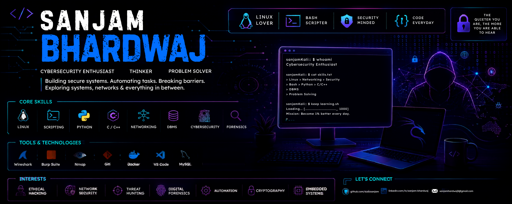

<div align="center">

# 👋 Hi, I'm Sanjam Bhardwaj

### Cybersecurity Enthusiast | Security Engineering Student | Linux

<p>
  Exploring cybersecurity, secure systems, Linux, networking, and software development
  while building practical security-focused projects.
</p>

<p>
  <a href="https://www.linkedin.com/in/sanjambhardwaj">
    
  </a>
  <a href="https://github.com/sudosanjam">
    
  </a>
  <a href="https://sudosanjam.vercel.app">
    
  </a>
</p>

</div>

---

## 🛡️ About Me

- 🎓 B.Tech CSE (IoT. CyberSec. BCT) student with a strong interest in Cybersecurity
- 🔐 Interested in Security Engineering, Ethical Hacking, Secure Systems, and Applied Cryptography
- 🐧 Comfortable working with Linux, Bash, system utilities, logs, processes, and permissions
- 🌐 Exploring Computer Networks, TCP/IP, DNS, DHCP, HTTP/HTTPS, TLS, and network security
- 💻 Building security tools and automation scripts using Python and Bash
- 🔎 Interested in Threat Hunting, Digital Forensics, Incident Response, and Malware Analysis
- 📡 Working with packet analysis and network debugging using tools such as Wireshark and tcpdump
- 🗄️ Developing a strong foundation in DBMS, SQL, and backend technologies
- ⚙️ Exploring embedded systems and security-oriented projects using ESP32 and related hardware
- 🚀 Continuously improving Data Structures & Algorithms and software engineering fundamentals

---

## 🔐 Cybersecurity

<p>
  
</p>

### Security Areas

- Network Security
- Ethical Hacking
- Vulnerability Analysis
- Threat Hunting
- Digital Forensics
- Incident Response
- Security Automation
- SIEM & Log Analysis
- Malware Analysis
- YARA
- Applied Cryptography
- Secure Systems
- Security Research

---

## 🌐 Networking

<p>
  
</p>

- TCP/IP
- DNS & DHCP
- HTTP / HTTPS
- TLS
- Routing & Networking Fundamentals
- Packet Analysis
- Wireshark
- tcpdump
- Network Troubleshooting

---

## 💻 Programming

<p>
  
</p>

### Languages

- Python
- Bash / Shell Scripting
- C
- C++
- Java
- JavaScript

### Programming Interests

- Security Automation
- System Programming
- Scripting
- Algorithms & Data Structures
- Backend Development
- Automation Tools

---

## 🐧 Linux & System Administration

<p>
  
</p>

- Linux command-line environment
- Bash scripting
- Process & service management
- File permissions
- System logs
- `grep`, `awk`, `sed`
- Networking utilities
- System troubleshooting
- Automation
- Docker fundamentals

---

## ⚙️ Tools & Technologies

<p>
  
</p>

- Git & GitHub
- Linux
- Docker
- VS Code
- Wireshark
- tcpdump
- YARA
- SIEM Tools
- Networking Utilities

---

## 🔬 Security & Technical Interests

```text
Cybersecurity
├── Network Security
│   ├── TCP/IP
│   ├── Packet Analysis
│   ├── Wireshark
│   └── Network Troubleshooting
│
├── Threat Detection
│   ├── Threat Hunting
│   ├── SIEM
│   ├── Log Analysis
│   └── YARA
│
├── Digital Forensics
│   ├── Log Analysis
│   ├── Timeline Analysis
│   └── Incident Response
│
├── Secure Systems
│   ├── Linux
│   ├── System Security
│   └── Security Automation
│
└── Cryptography
    ├── Cryptographic Fundamentals
    └── Applied Cryptography
